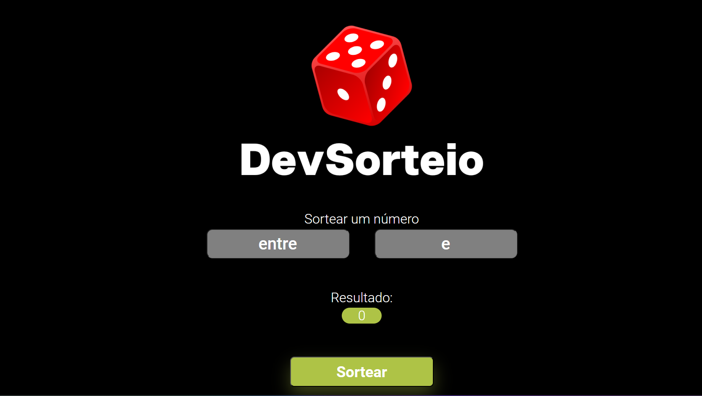
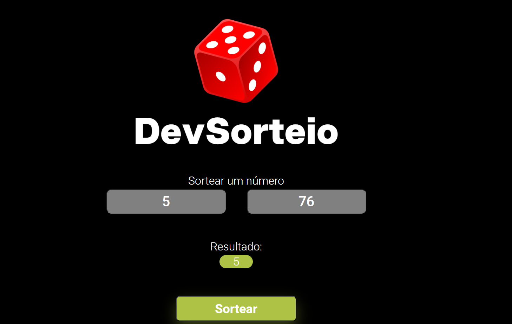

#DevSorteio#
<h1>Uma página simples que utiliza a função Math.random para sortear um número entre dois valores escolhidos pelo usuário</h1>
 
 

Esta página usa as funções <strong>Math.ceil</strong> e <strong>Math.floor</strong> para garantir que os números inseridos sejam inteiros. Em seguida, verifica se os valores são válidos com <strong>isNaN</strong>. Se tudo estiver correto, utiliza <strong>Math.random</strong> para sortear um número entre os dois valores informados.

No final, exibe o número sorteado diretamente na tela.
 
 
<h2>Tecnologias utilizadas:</h2> 
<ul>
    <li>HTML</li>
    <li>CSS</li> 
    <li>JavaScript</li> 
</ul>
 
<a href="https://atillarodrigues.github.io/DevSorteio/">Clique para ser redirecionado para o site</a>
 
<h2>Exemplos da página em funcionamento:</h2>

